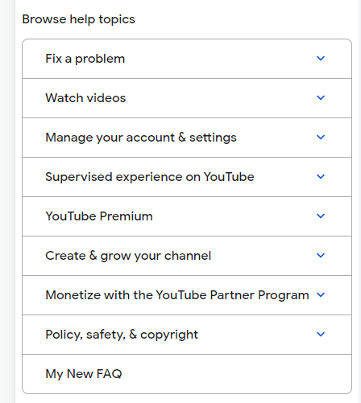
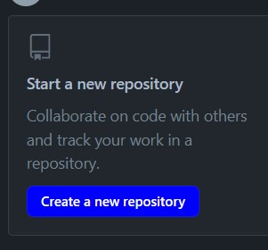
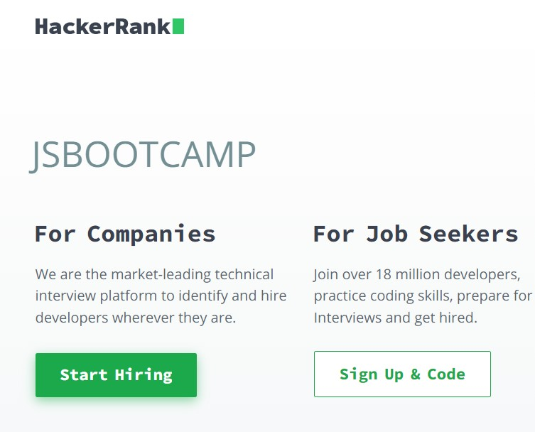
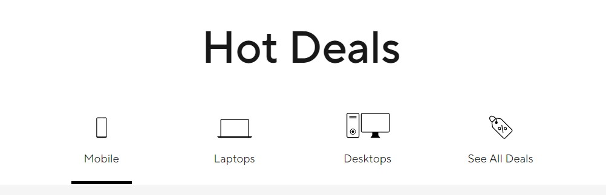
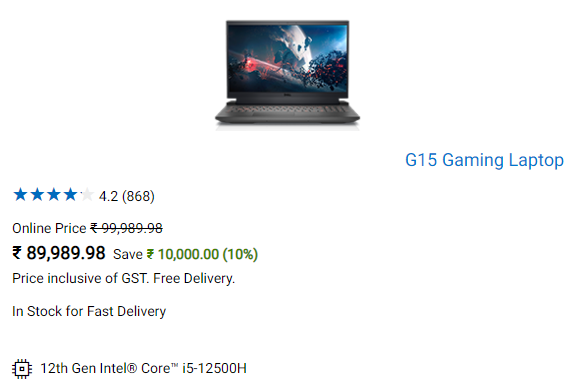
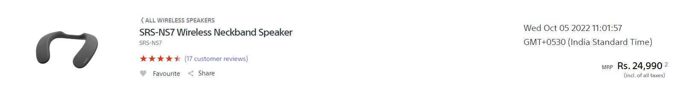
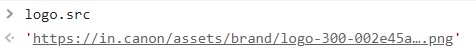

# Dom Manipulation Assignment

## 1. Webiste Name: [Dev To](https://dev.to/)

### Topics

    - Query Selctory, Inner HTML

### Sample Image


### Tasks

        Target the Top description div and change the DEV Community to <Your_Name> and description to your passion

### Output


### Solution 1

```

//fetch brand
let name = document.querySelector('.side-bar .crayons-card .crayons-subtitle-2')
name.innerHTML = "Abhishek Sharma"

//fetch description
let description = document.querySelector('.side-bar .crayons-card .color-base-70')
description.innerHTML = 'I write code'

```

### Solution 1: OUTPUT


<hr>

## 2. Website Name: [Apple](https://support.apple.com/en-in)

### Task


### Fetch all the product name and store in an array

### Output

['iPhone', 'Mac', 'iPad', 'Watch', 'AirPods', 'Music', 'TV']

### Solution 2

```

let allProductsNode = document.querySelectorAll(".as-imagegrid-item .as-imagegrid-item-title");

let allProducts =[];
for(let item of allProductsNode){
     allProducts.push(item.innerText.split('\n')[0])
}
console.log(allProducts)

```

### Solution 2: OUTPUT


<hr>

##

3. Webiste Name: [Youtube Support](https://support.google.com/youtube/)

### Topics

    - Get Element By Id, Create Element, Create Text Node, Append Child

### Sample Image


### Tasks

     Add another FAQ 'My New FAQ' to the list

### Output



### Solution 3:

```

// targetting navLink
let navLinks = document.querySelector('.accordion-homepage')

// creating newSection
let newSection = document.createElement('section')

// adding class to newSection
newSection.classList.add("parent")

// appending newSection and creating textNode
let newLink = newSection.appendChild(document.createTextNode('My New FAQ'))

// creating button element
let h3Button = document.createElement('h3')

// appending button with newLink created
h3Button.appendChild(newLink)

//appending h3 button inside section
newSection.appendChild(h3Button)

//appending section inside navLinks
navLinks.appendChild(newSection)

```

### Solution 3: OUTPUT


<hr>

## 4. Webiste Name: [OnePlus](https://www.oneplus.in/support)

### Topics

     Query Selector, InnerText

### Sample Image


### Tasks

      Change the contact number

### Output


### Solution 4

```
// targetting contact container
let contactContainer = document.querySelector(".customer-support .one-tel-number")

//changing innerText of contact
contactContainer.innerText = '+99999 99999'
```

### Solution 4:OUTPUT


<hr>

## 5. Webiste Name: [Samsung](https://www.samsung.com/in/offer/online/samsung-fest/)

### Topics

       getElementById, createElement, InnerText, append, setAttribute

### Sample Image


### Tasks

     Target the main div of card and change the Button text to Check out

### Output


### Solution 5

```
//get all buyNowButton
let buyNowNode = document.querySelectorAll('.diwali-deals-product-sale-pro .diwali-deals-product-sale-btn')

// loop around all buy now button and changing innerText
for(let item of buyNowNode){
     item.innerText = 'Check out'
}
```

### Solution 5: OUTPUT


<hr>

6. Webiste Name: [Adidas](https://www.adidas.co.in/)

### Topics

    -   Query Selector, Event listeners, Changing Styles

### Sample Image


### Tasks

     Target the search box and on hover change thebackground color to red.

### Output


### Solution 6

```
let searchBar = document.querySelector('.searchinput___19uW0');

searchBar.addEventListener('mouseover', (event)=>{searchBar.style.backgroundColor = 'red'})

searchBar.addEventListener('mouseout', (event)=>{searchBar.style.backgroundColor = '#eceff1'})
```

### Solution 6: OUTPUT


<hr>

7. Webiste Name: [MDN Web Docs](https://developer.mozilla.org/en-US/)

### Topics

       Form, Value, Submit

### Sample Image


### Tasks

     To Search a topic in the MDN Search bar.
     First add a text to search in the search bar and then hit the submit search button to search the docs using DOM

### Output


<hr>

8. Webiste Name: [Google](https://www.google.com/)

### Topics

       Remove Elements

### Sample Image


### Tasks

     Remove alternate languages from the home page languages listed

### Output


### Solution 8:

```
//collect all anchor tag
let element = document.querySelectorAll('#SIvCob a')

//target elment to append
let  appendElement = document.querySelector('.z4hgWe')

// make innerHTML empty first
appendElement.innerHTML = ''

// loop all elment and push only required children
for(let i=0; i < element.length; i++){
     if(i % 2 !== 0){
          // appending each child one by one to appendElement
          appendElement.appendChild(element[i])
     }
}
```

### Solution 8: OUTPUT


<hr>

9. Webiste Name: [Code Wars](https://www.codewars.com/)

### Topics

       Change Font Family, Color of Text.

### Sample Image


### Tasks

    Change the font family of the text to monospace and text color to the logo’s background color.

### Output


### Solution 9

```
let heading  = document.querySelector('.display-heading-1');
heading.style.fontFamily = 'monospace';
heading.style.color = '#b1361e';

```

### Solution 9: OUTPUT


<hr>

10. Webiste Name: [Freecodecamp](https://www.freecodecamp.org/)

### Topics

       querySelector, mouseover, click eventListener,  callback function, style,

### Sample Image


### Tasks

    Target the button and change background colour on mouseover

### Output


### Solution 10

```
let targetText = document.querySelectorAll('.login-btn-text')[1]

targetText.addEventListener('mouseover', (event)=>{targetText.style.backgroundColor = '#b1361e'})

targetText.addEventListener('mouseout', (event)=>{targetText.style.backgroundColor = '#feac32'})
```

### Solution 10: OUTPUT


<hr>

11. Webiste Name: [realme](https://www.realme.com/in/)

### Topics

       querySelector,style,background-image

### Sample Image


### Tasks

    change the realme logo to ineuron logo

### Output


### Solution 11

```
// iNeuron Logo -  https://ineuron.ai/images/ineuron-logo.png

//targetting logo
let logo = document.querySelector('a.logo.gtag')

// targetting child element
let span = document.querySelector('.icon.icon-logo.in')

// creating img tag
let img = document.createElement('img')

// adding source of iNeuron
img.src = 'https://ineuron.ai/images/ineuron-logo.png';

// adding width and height to img
img.width = '80';
img.height = '24';

// clear child first
logo.removeChild(span)

// append img tag to logo
logo.appendChild(img)
```

### Solution 11: OUTPUT


12. Webiste Name: [Github](https://github.com/)

### Topics

       querySelector,style,background-Color

### Sample Image


### Tasks

     change the background colour of the button to blue.

### Output


### Solution 12

```
let createRepoBtn = document.querySelectorAll('.btn.btn-sm.btn-primary')[1];
createRepoBtn.style.backgroundColor = 'blue';
```

### Solution 12: OUTPUT



13. Webiste Name: [Hackerrank](https://www.hackerrank.com/)

### Topics

       querySelector,innerHtml

### Sample Image


### Tasks

Target the top description and change “Matching developers with great companies” to ‘JSBOOTCAMP“.

### Output


### Solution 13

```
let header = document.querySelectorAll('.fl-heading-text')[0]
header.innerHTML = 'JSBOOTCAMP'
```

### Solution 13: OUTPUT



14. Webiste Name: [Asus](https://www.asus.com/in/)

### Topics

      querySelector,style,font-size

### Sample Image


### Tasks

       change the fontsize of “Hot Deals” to 80px

### Output


### Solution 14

```
let text = document.querySelector('.HotDealsAll__Heading__2fIbe')
text.style.fontSize = '100px'
```

### Solution 14: OUTPUT



15. Webiste Name: [Dell](https://www.dell.com/en-in/shop/deals/laptop-deals?gacd=10415953-9016-5761040-285981356-0&dgc=ST&gclid=Cj0KCQjwguGYBhDRARIsAHgRm4-XUDMhhVNyHXb3s1gY4ZBzORr_d9Se-buhJwy7asyUe7YdqEA11eEaAt6UEALw_wcB&gclsrc=aw.ds&nclid=BxjBlpBQsX6pjSHh-L8YYSU77EpfXRkG1AGMB5Wbeu386ykspfrPDnfx_DdFau20)

### Topics

      querySelector,style.textAlign

### Sample Image


### Tasks

       Convert the text “G15 Gaming Laptop” from left to right

### Output



### Solution 15

```
let title = document.querySelectorAll('.ps-title')[4];
title.style.textAlign = 'right'
'right'
```

### Solution 15: OUTPUT


16. Webiste Name: [Vercel](https://vercel.com/)

### Topics

     querySelector,innerHTMl

### Sample Image


### Tasks

      change the heading “Start with the developer” to “Start with Scratch”

### Output


### Solution 16

```
// targetting text DOM
let header = document.querySelectorAll('.section-title_title__VEDfK')[0];

// replacing innerHTML
header.innerHTML = 'Start with Scratch'
```

### Solution 16: OUTPUT


17. Webiste Name: [Sony](https://www.sony.co.in/)

### Topics

    querySelector,innerHTMl

### Sample Image


### Tasks

     change the button text To current Date.

### Output


### Solution 17

```
let date = new Date()
let btnContainer = document.querySelector('.btn-container')
btnContainer.innerHTML = date
```

### Solution 17: OUTPUT



18. Webiste Name: [Philips](https://www.philips.co.in/)

### Topics

     querySelector,style,backgroundcolor

### Sample Image


### Tasks

    change the background colour blue to orange

### Output


### Solution 18

```
document.querySelector('.p-footer').style.backgroundColor = 'orange'
```

### Solution 18: OUTPUT


19. Webiste Name: [Canon](https://in.canon/)

### Topics

          querySelector,src

### Sample Image


### Tasks

    extract the canon logo

### Output


### Solution 19

```
document.querySelector('.logo').src
```

### Solution 19: OUTPUT



20. Webiste Name: [Oppo](https://www.oppo.com/in/)

### Topics

          querySelector,style,color

### Sample Image


### Tasks

      Change the description colour black to orange

### Output


### Solution 20

```
let descriptionArray = document.querySelectorAll('.desc')
for (let item of descriptionArray) {
     item.style.color = 'orange'
}
```

### Solution 20: OUTPUT


